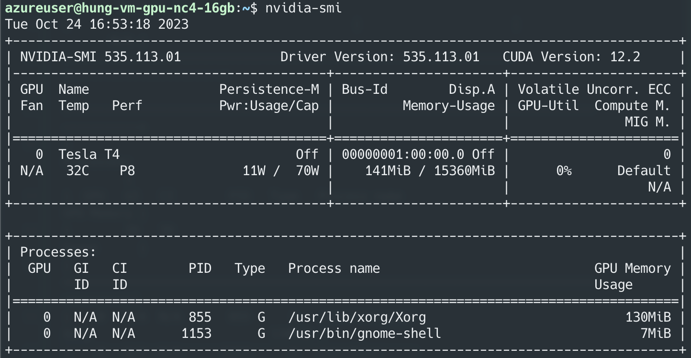

# my-pastebin
My public pastebin

## Install GPU with non-Secure boot VM

Follow 2 step here: 
- https://learn.microsoft.com/en-us/azure/virtual-machines/linux/n-series-driver-setup#ubuntu
- https://learn.microsoft.com/en-us/azure/virtual-machines/linux/n-series-driver-setup#ubuntu

## Install GPU on Secure boot VM

You can follow the official [Source](https://learn.microsoft.com/en-us/azure/virtual-machines/linux/n-series-driver-setup#install-cuda-driver-on-ubuntu-with-secure-boot-enabled) of Azure. I will brief some ***IMPORTANT NOTE***

- Please start from the above section (in the link). Do not start from the Ubuntu section, it will cause conflict.
- On the 1st step: 

  - Please check your VM's spec using
    ```
    # Checking GPU name
    lspci | grep -i NVIDIA
    
    # Check your machine
    lsb_release -a
    
    # Check your architecture
    uname -m
    ```
  - Base on these info., check this (page)[https://www.nvidia.com/Download/Find.aspx] to see the suitable version. You will see a lot of version, but pay attention to 2 number, for example:
    - Version: 535.104.12
    - CUDA Toolkit: 12.2
  - For the version, you can take the first part (e.g., 535), this will be the `NVIDIA_DRIVER_VERSION` number. Set this as your environment variable

    ```
    export NVIDIA_DRIVER_VERSION=...
    sudo apt-get update
    sudo apt install -y \
        linux-modules-nvidia-${NVIDIA_DRIVER_VERSION}-azure\
        nvidia-driver-${NVIDIA_DRIVER_VERSION}
    ```
- You can follow the following steps normally.
- You will stop when run `nvidia-smi` successfully, look like this.
  


## Clean Nvidia environment

If you messed up, before make a new VM, try these command to clean the environment.

```[bash]
sudo apt-get remove --purge '^nvidia-.'
sudo apt-get remove --purge '^cuda-.'
```

## Install Docker

For Docker: follow this [guideline](https://docs.docker.com/engine/install/ubuntu/#installation-methods).
